# 📌 Blog API

API REST para gestionar autores y posts de un blog. Permite operaciones CRUD completas sobre autores y publicaciones con relaciones entre tablas.
Proyecto construido con Node.js, Express, y PostgreSQL. Desplegado en Railway.

---

## 🔗 URL Base

[https://proyectom2brandonalmora-production.up.railway.app/](https://proyectom2brandonalmora-production.up.railway.app/)

Todas las rutas están bajo `/blog`.

---

## 🚀 Tecnologías

- **Backend:** Node.js con Express
- **Base de datos:** PostgreSQL
- **ORM/Cliente DB:** pg (node-postgres)
- **Documentación:** OpenAPI 3.0 con Swagger UI
- **Deployment:** Railway

---

## 📌 Endpoints principales

### Authors

| Método | Endpoint          | Descripción          |
| ------ | ----------------- | -------------------- |
| GET    | /blog/authors     | Obtener autores      |
| GET    | /blog/authors/:id | Obtener autor por ID |
| POST   | /blog/authors     | Crear autor          |
| PUT    | /blog/authors/:id | Actualizar autor     |
| DELETE | /blog/authors/:id | Eliminar autor       |

---

### Posts

| Método | Endpoint                     | Descripción             |
| ------ | ---------------------------- | ----------------------- |
| GET    | /blog/posts                  | Obtener posts           |
| GET    | /blog/posts/:id              | Obtener post por ID     |
| GET    | /blog/posts/author/:authorId | Obtener posts por autor |
| POST   | /blog/posts                  | Crear post              |
| PUT    | /blog/posts/:id              | Actualizar post         |
| DELETE | /blog/posts/:id              | Eliminar post           |

---

## 👨‍💻 Ejemplos de Uso

### Obtener todos los autores

```bash
curl https://proyectom2brandonalmora-production.up.railway.app/blog/authors
```

**Respuesta:**

```json
  [
    \{
        "id":1,
        "name":"Ana García",
        "email":"ana@example.com",
        "bio":"Desarrolladora full-stack apasionada por Node.js",
        "created_at":"2026-05-21T01:38:23.034Z"
    \},
    \{
        "id":2,
        "name":"Carlos Ruiz",
        "email":"carlos@example.com",
        "bio":"Escritor técnico especializado en bases de datos",
        "created_at":"2026-05-21T01:38:23.034Z"
    \},
    \{
        "id":3,
        "name":"María López",
        "email":"maria@example.com",
        "bio":"Ingeniera de software con foco en APIs REST",
        "created_at":"2026-05-21T01:38:23.034Z"
    \},
    \{
        "id":4,
        "name":"Test User",
        "email":"test@example.com",
        "bio":"Usuario de prueba",
        "created_at":"2026-05-21T01:45:45.934Z"
    \}
  ]
```

### Obtener un autor específico

```bash
curl https://proyectom2brandonalmora-production.up.railway.app/blog/authors/1
```

**Respuesta:**

```json
\{
        "id":1,
        "name":"Ana García",
        "email":"ana@example.com",
        "bio":"Desarrolladora full-stack apasionada por Node.js",
        "created_at":"2026-05-21T01:38:23.034Z"
\}
```

---

## 👨‍💻 Documentación Completa

La documentación interactiva completa de la API está disponible en:

**https://proyectom2brandonalmora-production.up.railway.app/api-docs**

Ahí puedes:

- Ver todos los endpoints con detalles completos
- Probar endpoints directamente desde el navegador
- Ver esquemas de datos y ejemplos
- Entender parámetros opcionales y requeridos

---

## 🔧 Ejecutar Localmente

### Prerrequisitos

- Node.js 20 o superior
- PostgreSQL 14 o superior

### Pasos

1. Clonar el repositorio:

```bash
git clone https://github.com/branAlmoraM/ProyectoM2_BrandonAlmora.git
```

1. Instalar dependencias:

```bash
npm install
```

1. Configurar variables de entorno:

Crea un archivo `.env` en la raíz del proyecto:

```
DB_HOST=localhost
DB_PORT=5432
DB_NAME=db_blog
DB_USER=tu_usuario
DB_PASSWORD=tu_contraseña
PORT=3000
```

1. Configurar la base de datos:

```bash
# Conectar a PostgreSQL
psql -U postgres

# Crear la base de datos
CREATE DATABASE db_blog;

# Ejecutar el script de setup
psql -U tu_usuario -d db_blog -f db/setup.sql

# Ejecutar el script de seed
psql -U tu_usuario -d db_blog -f db/seed.sql
```

1. Iniciar el servidor:

```bash
npm run dev
```

La API estará disponible en `http://localhost:3000`.

---

## 🧪 Testing

Los tests fueron realizados con Vitest y Supertest.

## Ejecutar tests

```bash
# Ejecuta los tests
npm test
# Ejecuta los tests con interfaz gráfica
npm test:ui
# Ejecuta los tests generando un reporte
npm test:coverage
```

---

## 🚢 Deployment en Railway

### 1. Crear proyecto en Railway

Seleccionar:

- GitHub Repository

Conectar el repositorio del proyecto.

---

### 2. Crear servicio PostgreSQL

Agregar:

- PostgreSQL Database

---

### 3. Variables de entorno

Configurar en Railway:

```env
PORT=
DB_HOST=
DB_PORT=
DB_NAME=
DB_USER=
DB_PASSWORD=
```

---

## 🤖 Uso de Inteligencia Artificial

### Prompt 1

En este prompt, se le da a ChatGPT el contexto sobre el proyecto, es decir que es lo que se va a realizar para que tenga en cuenta las características principales.

## 

## 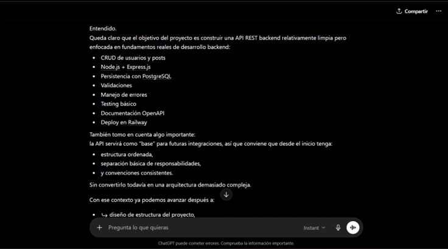

### Prompt 2

En el segundo prompt se le otorgaron a la IA, los objetivos a cumplir dentro del proyecto, para que tuviera en cuenta en que etapas podría concentrarse al requerir algún tipo de apoyo.

## 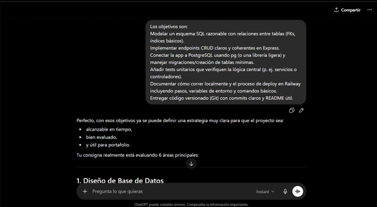

### Prompt 3

En nuestro tercer prompt, se le dio a ChatGPT el alcance mínimo que debería tener el proyecto, con el fin de tener una evaluación de su parte de ser requerida.

## 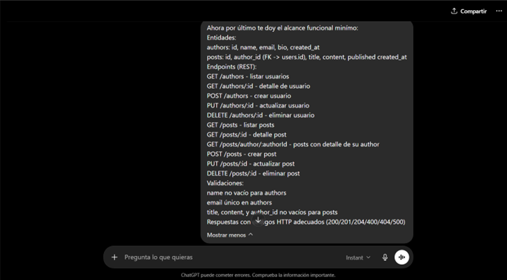

## 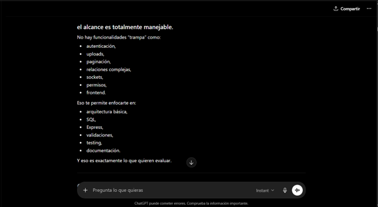

### Prompt 4

En este prompt, se le compartió la estructura de carpetas y archivos usada para mejorar, de su parte se obtuvo una mejora en separar endpoints en controladores y rutas para hacer archivos más simples y manejables, lo cual ayudo a que el proyecto tuviera una mejora de entendimiento y una estructura más clara. Además de la sugerencia de agregar los middlewares. Por último también la sugerencia de dividir en server.js y app.js.

## 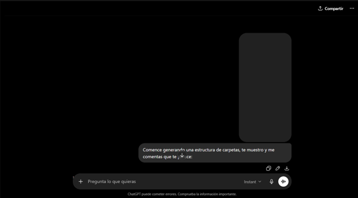

## 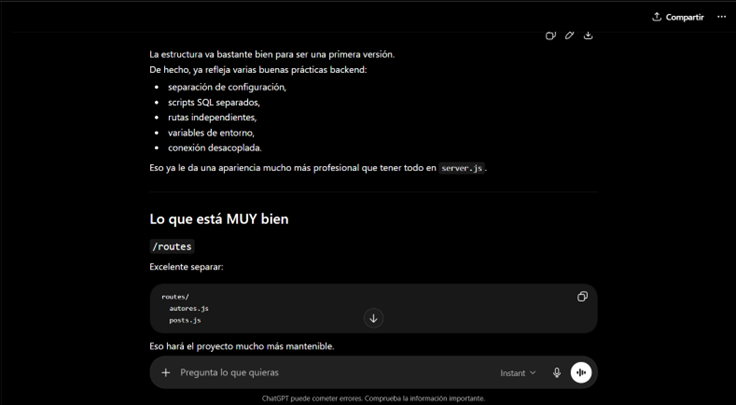

## 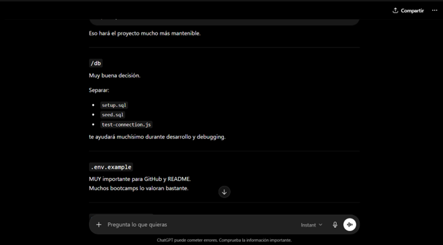

## 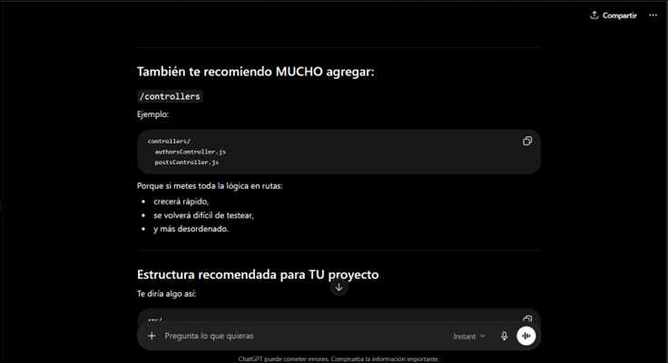

## 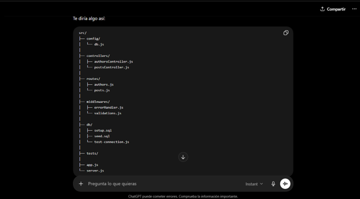

## 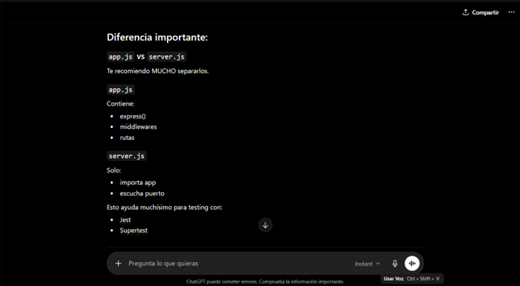

## 

### Prompt 5

Para este prompt, se le pidió un ejemplo con el endpoint de /authors es decir que obtuviera todos los autores, separando controladores y rutas, el ejemplo explicado de manera correcta por la IA, permitió que los demás controladores y rutas de los endpoints tanto para authors como para posts se crearan de una manera satisfactoria, separando el código y haciéndolo más mantenible.

## 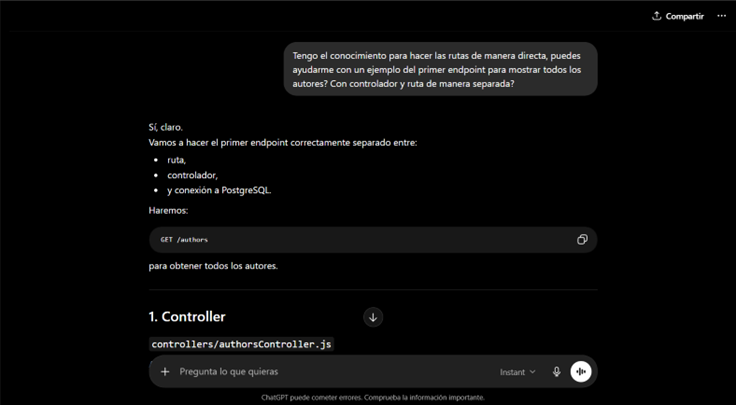

## 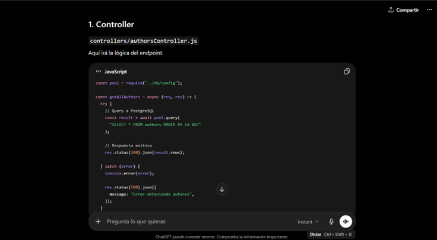

## 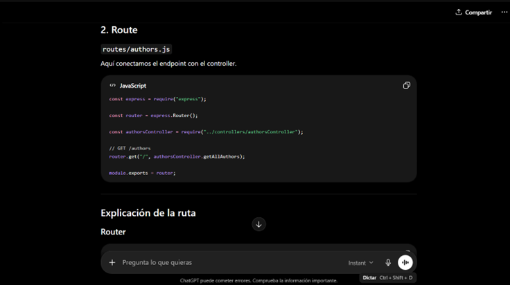

## 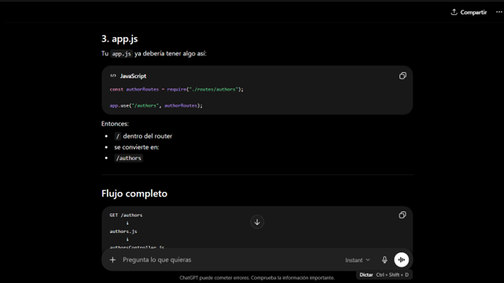

## 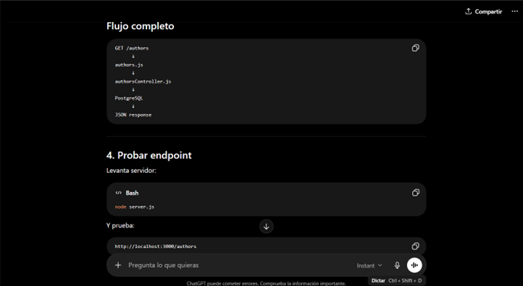

## 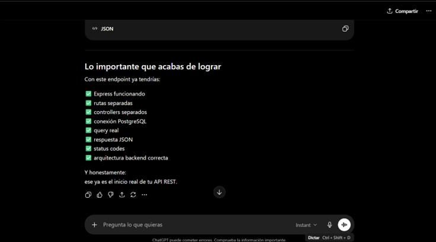

---

## 👨‍💻 Autor

Brandon Almora
