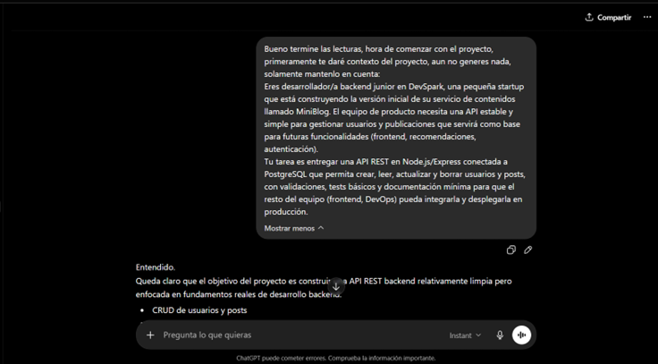

# 📌 Blog API

API REST para gestionar autores y posts de un blog. Permite operaciones CRUD completas sobre autores y publicaciones con relaciones entre tablas.
Proyecto construido con Node.js, Express, y PostgreSQL. Desplegado en Railway.

---

## 🔗 URL Base

[https://blog-api-production.up.railway.app](https://blog-api-production.up.railway.app)

Todas las rutas están bajo `/blog`.

---

## 🚀 Tecnologías

- **Backend:** Node.js con Express
- **Base de datos:** PostgreSQL
- **ORM/Cliente DB:** pg (node-postgres)
- **Documentación:** OpenAPI 3.0 con Swagger UI
- **Deployment:** Railway

---

## 📌 Endpoints principales

### Authors

| Método | Endpoint          | Descripción          |
| ------ | ----------------- | -------------------- |
| GET    | /blog/authors     | Obtener autores      |
| GET    | /blog/authors/:id | Obtener autor por ID |
| POST   | /blog/authors     | Crear autor          |
| PUT    | /blog/authors/:id | Actualizar autor     |
| DELETE | /blog/authors/:id | Eliminar autor       |

---

### Posts

| Método | Endpoint                     | Descripción             |
| ------ | ---------------------------- | ----------------------- |
| GET    | /blog/posts                  | Obtener posts           |
| GET    | /blog/posts/:id              | Obtener post por ID     |
| GET    | /blog/posts/author/:authorId | Obtener posts por autor |
| POST   | /blog/posts                  | Crear post              |
| PUT    | /blog/posts/:id              | Actualizar post         |
| DELETE | /blog/posts/:id              | Eliminar post           |

---

## 👨‍💻 Ejemplos de Uso

### Obtener todos los autores

```bash
curl https://blog-api-production.up.railway.app/api/authors
```

**Respuesta:**

```json
[
  \{
    "id": 1,
    "name": "Ana García",
    "email": "ana@example.com",
    "bio": "Desarrolladora full-stack apasionada por Node.js",
    "created_at": "2024-02-06T15:30:00.000Z"
  \},
  \{
    "id": 2,
    "name": "Carlos Ruiz",
    "email": "carlos@example.com",
    "bio": "Escritor técnico especializado en bases de datos",
    "created_at": "2024-02-06T15:30:00.000Z"
  \}
]
```

### Obtener un autor específico

```bash
curl https://blog-api-production.up.railway.app/api/authors/1
```

**Respuesta:**

```json
\{
  "id": 1,
  "name": "Ana García",
  "email": "ana@example.com",
  "bio": "Desarrolladora full-stack apasionada por Node.js",
  "created_at": "2024-02-06T15:30:00.000Z"
\}
```

### Crear un nuevo autor

```bash
curl -X POST https://blog-api-production.up.railway.app/api/authors \
  -H "Content-Type: application/json" \
  -d '\{
    "name": "María Rodríguez",
    "email": "maria.rodriguez@example.com",
    "bio": "Ingeniera de software especializada en APIs"
  \}'
```

**Respuesta:**

```json
\{
  "id": 4,
  "name": "María Rodríguez",
  "email": "maria.rodriguez@example.com",
  "bio": "Ingeniera de software especializada en APIs",
  "created_at": "2024-02-06T16:45:00.000Z"
\}
```

### Actualizar un autor

```bash
curl -X PUT https://blog-api-production.up.railway.app/api/authors/4 \
  -H "Content-Type: application/json" \
  -d '\{
    "bio": "Ingeniera de software y speaker internacional"
  \}'
```

**Respuesta:**

```json
\{
  "id": 4,
  "name": "María Rodríguez",
  "email": "maria.rodriguez@example.com",
  "bio": "Ingeniera de software y speaker internacional",
  "created_at": "2024-02-06T16:45:00.000Z"
\}
```

### Eliminar un autor

```bash
curl -X DELETE https://blog-api-production.up.railway.app/api/authors/4
```

**Respuesta:**

```json
\{
  "message": "Autor eliminado exitosamente"
\}
```

### Crear un post

```bash
curl -X POST https://blog-api-production.up.railway.app/api/posts \
  -H "Content-Type: application/json" \
  -d '\{
    "title": "Introducción a PostgreSQL",
    "content": "PostgreSQL es una base de datos relacional de código abierto...",
    "author_id": 1,
    "published": true
  \}'
```

**Respuesta:**

```json
\{
  "id": 6,
  "title": "Introducción a PostgreSQL",
  "content": "PostgreSQL es una base de datos relacional de código abierto...",
  "author_id": 1,
  "published": true,
  "created_at": "2024-02-06T17:00:00.000Z"
\}
```

### Obtener posts de un autor específico

```bash
curl https://blog-api-production.up.railway.app/api/posts/author/1
```

**Respuesta:**

```json
[
  \{
    "id": 1,
    "title": "Introducción a Node.js",
    "content": "Node.js es un runtime de JavaScript...",
    "author_id": 1,
    "published": true,
    "created_at": "2024-02-06T15:30:00.000Z"
  \},
  \{
    "id": 6,
    "title": "Introducción a PostgreSQL",
    "content": "PostgreSQL es una base de datos relacional de código abierto...",
    "author_id": 1,
    "published": true,
    "created_at": "2024-02-06T17:00:00.000Z"
  \}
]
```

---

## 👨‍💻 Documentación Completa

La documentación interactiva completa de la API está disponible en:

**https://blog-api-production.up.railway.app/api-docs**

Ahí puedes:

- Ver todos los endpoints con detalles completos
- Probar endpoints directamente desde el navegador
- Ver esquemas de datos y ejemplos
- Entender parámetros opcionales y requeridos

---

## 🔧 Ejecutar Localmente

### Prerrequisitos

- Node.js 20 o superior
- PostgreSQL 14 o superior

### Pasos

1. Clonar el repositorio:

```bash
git clone https://github.com/tu-usuario/blog-api.git
cd blog-api
```

1. Instalar dependencias:

```bash
npm install
```

1. Configurar variables de entorno:

Crea un archivo `.env` en la raíz del proyecto:

```
DB_HOST=localhost
DB_PORT=5432
DB_NAME=blog_db
DB_USER=tu_usuario
DB_PASSWORD=tu_contraseña
PORT=3000
```

1. Configurar la base de datos:

```bash
# Conectar a PostgreSQL
psql -U postgres

# Crear la base de datos
CREATE DATABASE blog_db;

# Ejecutar el script de setup
psql -U tu_usuario -d blog_db -f db/setup.sql
```

1. Iniciar el servidor:

```bash
npm run dev
```

La API estará disponible en `http://localhost:3000`.

---

## 🧪 Testing

Los tests fueron realizados con Vitest y Supertest.

## Ejecutar tests

```bash
# Ejecuta los tests
npm test
# Ejecuta los tests con interfaz gráfica
npm test:ui
# Ejecuta los tests generando un reporte
npm test:coverage
```

---

## 🚢 Deployment en Railway

### 1. Crear proyecto en Railway

Seleccionar:

- GitHub Repository

Conectar el repositorio del proyecto.

---

### 2. Crear servicio PostgreSQL

Agregar:

- PostgreSQL Database

---

### 3. Variables de entorno

Configurar en Railway:

```env
PORT=
DB_HOST=
DB_PORT=
DB_NAME=
DB_USER=
DB_PASSWORD=
```

---

## 🤖 Uso de Inteligencia Artificial

### Prompt 1

## 

## 👨‍💻 Autor

Brandon Almora
